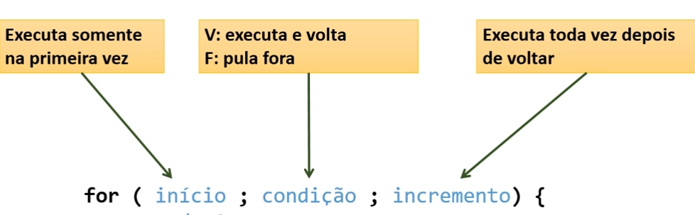

## Estrutura repetitiva “enquanto”

É uma **estrutura de controle** que **repete** um bloco de comandos enquanto uma **condição** for verdadeira.

### Quando usar:

Quando **não** se sabe previamente a quantidade de repetições que será realizada.

#### Sintaxe

```java
while ( condição ) {
	comando 1
	comando 2
}
```

Exemplo:

```java
while (x != 0) { //Enquanto x for diferente de 0
   x =  sc.nextInt(); //x continua recebendo valores
}
```

---

## Estrutura repetitiva “para” (for)

é uma estrutura de comando de controle que repete um bloco de comandos para um certo intervalo de valores.

#### Quando usar:

Quando se sabe previamente a quatidade de repetição ou intervalo de valores.

#### Sintaxe / regra:

`for ( inicio; condição; incremento ) {`



#### Exemplo:

```java
int soma = 0;
for (int i = 0; i < N; i++) { 
	 int x = sc.nextInt(); //variável temporária
	 soma += x;
}
```

<aside>

> 💡i é o contador do laço, enquanto i for menor que N (valor escolhido pelo usuário), i conta + 1.

</aside>

### Como acontece a contagem do laço?

Por exemplo, se usarmos o laço para imprimir uma contagem que começa em 0 e vai até 5:

```java
for (int i = 0; i < 5; i++) {
	 System.out.println("Valor de i: " + i);
}
```

Ele irá exibir a seguinte mensagem:

`Valor de i: 0`

`Valor de i: 1`

`Valor de i: 2`

`Valor de i: 3`

`Valor de i: 4`

---

## Estrutura repetitiva “faça-enquanto”

Menos utilizada, mas em alguns casos se encaixa melhor ao problema.

O bloco de comandos executa pelo menos uma vez, pois a condição é verificada no final.

#### Sintaxe

```java
do {
	comando 1
	comando 2
} while (condição) ;
```

#### Problema exemplo:

Fazer um programa para ler a temperatura em Celsius e mostrar o equivalente em Fahrenheit. Perguntar se o usuário deseja repetir (s/n). Caso o “S”, repetir o programa.

```java
do { //Faça
    System.out.print("Digite a temperatura em Celsius: ");
    Double C = sc.nextDouble();
    Double F = 9.0 * C / 5.0 + 32.0;
    System.out.printf("Equivalente a Fahrenheit: %.1f%n", F);
    System.out.println("Deseja continuar? [S/N] ");
    resp = sc.next().charAt(0); //Apenas letra na posição 0
} while (resp != 'N');
```